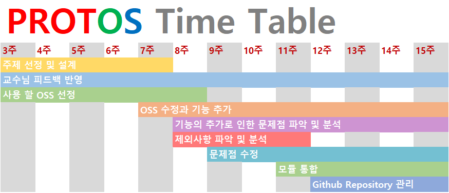

# 2020 OSSP 1학기

# Project PROTOS   
**(PROTect Our facial Secure)**

## Team Ninety-Nine

* 김민우(팀장)
  * 김지민
  * 김태용
  * 원태호


## 프로젝트 주제

### 주제 목적

- 따라서 사람의 얼굴을 자연스러운 가짜 얼굴로 대체하여 사진으로 인한 개인 정보 유출 보안.

### 선정 이유

- 얼굴 인식과 홍채인식의 기술이 상용화 되어 사진으로 인한 개인 정보의 유출 위험 존재.
- 대부분 사진에서 얼굴을 스티커로 가리거나 모자이크 처리를 하지만 모자이크는 역 변환 가능.

### 주요 기능

- 본인의 얼굴이 나온 사진 업로드
    - 본인의 얼굴 인식을 위하여
- 본인의 얼굴을 제외 한 얼굴 인식
- 가상의 얼굴 생성
- 가상의 얼굴과 본인을 제외한 얼굴 교체


## 개발 환경
- colab
- python 3.6
- nvidia
    - cuda 10
- tensorflow 1.15


[Requirements](https://github.com/CSID-DGU/2020-1-OSSP1-ninetynine-2/blob/master/requirements.txt)


## 실행 방법
~~


## Time Table



## License
이 프로젝트는 아래 명시 된 것처럼 다양한 OSS를 활용하여 만들어낸 프로젝트입니다.   
face_recognition는 MIT License 이고 나머지 두개는 No Lisence입니다.   
참고 하고 사용해주시길 바랍니다.   
[face_recognition's Lisence](https://https://github.com/ageitgey/face_recognition/blob/master/LICENSE)


### 원본 소스(출처)
- face_recognition - <https://github.com/ageitgey/face_recognition>
- ~NVidia StyleGAN2 - <https://github.com/NVlabs/stylegan2>~
- ~Flickr-Faces-HQ Dataset (FFHQ) - <https://github.com/NVlabs/ffhq-dataset>~
- StyleGan-encoder - <https://github.com/jacobhallberg/pytorch_stylegan_encoder>
- FaceSwap - <https://github.com/wuhuikai/FaceSwap>
- PRNet - <https://github.com/YadiraF/PRNet>


# FaceSwap
Swap face between two photos for Python 3 with OpenCV and dlib.

## Get Started
```sh
python main.py --src imgs/test6.jpg --dst imgs/test7.jpg --out results/output6_7.jpg --correct_color
```

| Source | Destination | Result |
| --- | --- | --- |
| |  |  |

```sh
python main.py --src imgs/test6.jpg --dst imgs/test7.jpg --out results/output6_7_2d.jpg --correct_color --warp_2d
```

| Source | Destination | Result |
| --- | --- | --- |
| |  |  |


## Install
### Requirements
* `pip install -r requirements.txt`
* OpenCV 3: `conda install opencv` (If you have conda/anaconda)

Note: See [requirements.txt](requirements.txt) for more details.
### Git Clone
```sh
git clone https://github.com/wuhuikai/FaceSwap.git
```
### Swap Your Face
```sh
python main.py ...
```
Note: Run **python main.py -h** for more details.


### Real-time camera
```sh
python main_video.py --src_img imgs/test7.jpg --show --correct_color --save_path {*.avi}
```
### Video
```sh
python main_video.py --src_img imgs/test7.jpg --video_path {video_path} --show --correct_color --save_path {*.avi}
```

## More Results
| From | To |
| --- | --- |
|  |  |
|  |  |
|  |  |
|  |  |
|  |  |
